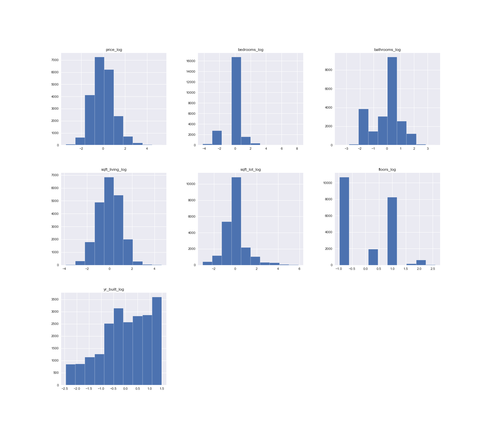
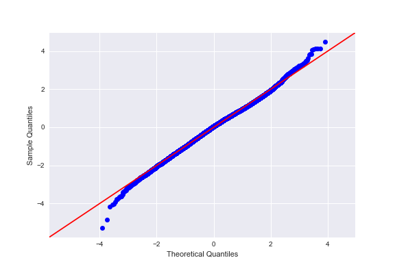

# Phase 2 Project 

**Author**: Alec Hing


## Project Overview

Using multiple linear regression modeling, housing sales data in a northwestern county is analyzed.

## Business Problem

It is sometimes difficult for new homeowners and investors who have the goal making a profit in the real estate market. Several factors come into play when the goal is to buy a home to flip it for a profit. Deciding on what a potential buyer of a home really values when they make a purchase of a home can be crucial for trying to sell these homes. Sifting through all these variables when buying a home is overwhelming and determining which variable can yield the best value for the buyer is difficult.
Making the wrong choice in this department can put an investor or new homeowner in the negative later down the road.


## The Data

This analysis uses the King County House Sales dataset, which can be found in  `kc_house_data.csv` in the data folder in this assignment's GitHub repository. The description of the column names can be found in `column_names.md` in the same folder. 

The following features were used in this data analysis:

* `price`
* `bedrooms`
* `bathrooms`
* `sqft_living`
* `sqft_lot`
* `floors`
* `waterfront`
* `view`
* `condition`
* `grade`
* `yr_built`
* `yr_renovated`

## Methods/ Modeling

After importing the appropriate libraries, the useful data needed for the business problem was selected. It was then scrubbed and cleaned so further data analysis could be done more accurately. This included removing NaN values and determining which values were neccessary. To get an understanding of what the cleanned data looked like before manipulations were done, a baseline model was created and several graphs were made for visualization purposes. (Historgrams, OLS Regression results,scatterplots, and heatmaps). The graphs also helped to see if data followed a normal distribution and had linearity. Assumptions of linear regression also need to be accounted for such as nomality, Q-Q plots, homoscedasticity, and multicollinearity. Finally, the data was modeled and maniputed to determine the best R-squared and coefficients to use to make the business reccomendation.  

## Regression Results

Homes with grade of low average vs. one with grade “very good” would be ~$495,000 cheaper than one that’s “very good”. Homes with a home of grade “fair” are ~$546,800 cheaper than one that is of grade “very good”. Homes with a home of grade “poor” are ~$567200 cheaper than one of grade “very good”.
A home with no view would save ~$57,200 compared to one that has an average view.

### Baseline Model


Baseline histogram of data before manipulations were done.

### Nomalized & Logged Model



Histogram of data after beeing logged and normalized.

### Q-Q Plot of Normalized Data


QQ Plot after logging and normalizng data.

## Conclusion

Several manipulaitons of the baseline data were performed. These included removing P-values greater than 0.5, removing a highly correlated variable like "bedrooms", removing outliers outside of 3 standard deviations, and logging+ normalizing the data. After all this was done, it turned out that the best R-squared value came from the baseline model which is why that variable was chosen as the final set of data to go off of. The normalized data had the more normal distributed data among all the other versions. It also had the more linear looking QQ plot. Coefficients with high values were chosen from the baseline OLS results. These include a grade of low average,a grade of fair, a grade of poor, and a view of "None". These were chosen because they were negative coefficients. Because price was used as the dependant varible, these coefficients become relative to that. The higher these variables are the lower the house price will be; meaning buying a home with these varibles in mind, a homeowner a cheaper house to flip for a profit.
To sum up, buy a home with a grade: low average, grade: fair, grade: poor, or with no view. Buying a home with these characteristics would save the buyer on average $416,550. A home with no view would save ~57,200 compared to one that has an average view.

To be able to increase a home’s value, it is suggested to improve the grade of the home to preferably Better, very good, excellent, or luxury if the funds are available. Homes with some type of renovation done to them increase their value by ~42,300 as opposed to those that do not have any done. Getting a home to a condition of Good or Very Good would increase to home’s value as well. Getting a home up to a grade of excellent, luxury, or even mansion can increase its value on average by 976,633 than one that is "very good". Finally if it's possible to add a view to the home, it would add on on average 108,172 more to the final price of the home.

## For More Information

For any additional questions, please contact **Alec & ahing619@gmail.com**
Full analysis of project in [Jupyter notebook](./student.ipynb) or in [presentation](./Phase2_presentation.pdf)


## Repository Structure


```
├── README.md                           
├── students.ipynb                      <- Analysis in of this project in Jupyter notebook
├── Phase2_Presentation.pdf             <- PDF version of project presentation
├── data                                <- Both sourced externally and generated from code
└── images                              <- Generated from code


